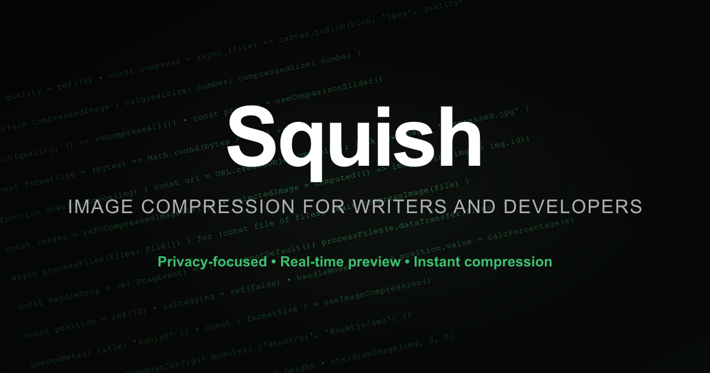
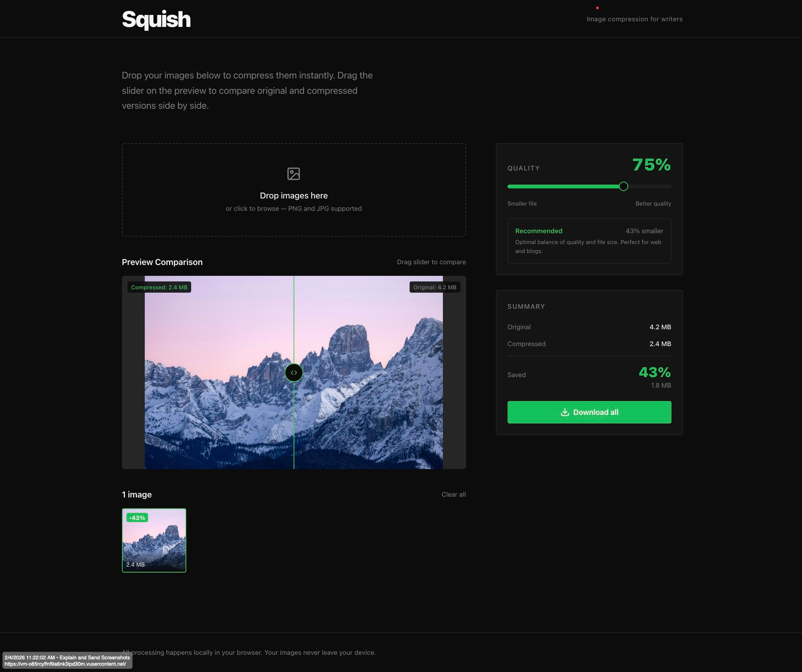

# Squish

[](https://opensource.org/licenses/MIT)
[](https://nuxt.com/)
[](https://vuejs.org/)
[](https://www.typescriptlang.org/)
[](https://ui.nuxt.com/)
[](https://nuxtseo.com/)

> **Image compression for writers and developers**

A modern, privacy-focused image compression tool built with Nuxt 4. Squish helps writers and developers optimize their images with a beautiful, interactive preview comparison slider and real-time quality adjustments.





## ✨ Features

- **🔒 Privacy First**: All processing happens locally in your browser — your images never leave your device
- **👁️ Live Preview Comparison**: Interactive side-by-side slider to compare original vs compressed images
- **🔍 Zoom & Pan**: Magnify up to 800% with mouse wheel zoom and click-and-drag panning for pixel-level inspection
- **⚡ Real-time Updates**: See compression effects instantly as you adjust quality settings
- **📏 Large Preview Window**: Optimized for wide screens with up to 2000px layout for detailed inspection
- **🎨 Modern UI**: Dark theme with clean, intuitive interface using Nuxt UI components
- **📱 Responsive Design**: Works seamlessly across desktop, tablet, and mobile devices
- **🎯 Smart Quality Control**: Color-coded warnings (green/yellow/red) for quality levels with inline compression stats
- **📦 Batch Processing**: Compress multiple images at once
- **💾 Easy Download**: Download individual images or all at once with file size and savings displayed
- **🖼️ Sample Image Demo**: Load a sample image to try the tool without needing your own files

## 🚀 Quick Start

### Prerequisites

- Node.js 22+ (see `.nvmrc` for exact version)
- yarn or npm

> **Note**: This is a **Nuxt 4** application. Make sure you're using compatible tooling.

### Installation

```bash
# Clone the repository
git clone https://github.com/ICJIA/icjia-squish-2026.git
cd icjia-squish-2026

# Install dependencies
yarn install

# Start development server
yarn dev
```

The app will be available at `http://localhost:3000`

## 📦 Building for Production

```bash
# Generate static site
yarn generate

# Preview production build
yarn preview

# Or build for SSR
yarn build
```

## 🛠️ Tech Stack

- **[Nuxt 4](https://nuxt.com/)** - Latest version of The Intuitive Vue Framework
- **[Vue 3](https://vuejs.org/)** - Progressive JavaScript Framework
- **[Nuxt UI](https://ui.nuxt.com/)** - Fully styled and customizable components
- **[Nuxt SEO](https://nuxtseo.com/)** - Complete SEO solution with sitemap, robots, and meta tags
- **[TypeScript](https://www.typescriptlang.org/)** - Type-safe JavaScript
- **[Tailwind CSS v4](https://tailwindcss.com/)** - Utility-first CSS framework
- **Canvas API** - Client-side image processing
- **[Vitest](https://vitest.dev/)** - Unit testing framework with coverage reporting

## 📖 How It Works

1. **Try It Out**: Click "Load Sample Image" to see the tool in action, or drop your own images
2. **Drop or Upload**: Drag and drop images or click to browse
3. **Adjust Quality**: Use the slider to set compression level (10–100%)
4. **Preview Comparison**: Drag the comparison slider to see the difference; scroll to zoom in for detail
5. **Download**: Save individual images or download all at once — file sizes and savings are shown inline

### Compression Process

- Images are processed using the HTML5 Canvas API
- Preserves original format (PNG, JPEG, WebP) with adjustable quality
- Original images remain untouched - new compressed versions are created
- All processing happens client-side for maximum privacy

## 🎨 UI Features

### Preview Comparison Window
- **Large viewing area**: Up to 2000px layout width on wide screens
- **3:2 aspect ratio**: Optimal for most images
- **Min height**: 700px for comfortable viewing
- **Interactive slider**: Smooth drag-to-compare experience
- **Zoom controls**: Zoom in/out (100%–800%) with reset button and mouse wheel support
- **Pan mode**: Click and drag to pan when zoomed above 100%
- **Persistent drag**: Slider and pan track the mouse even when cursor leaves the image area

### Quality Control
- **Visual slider**: Clear track with current value display
- **Quality indicators**: Color-coded warnings — green (50%+), yellow (25–49%), red (below 25%) — so you know when quality may suffer
- **Real-time stats**: See original size, compressed size, and savings percentage inline
- **Smart defaults**: Starts at 75% quality for optimal balance

## 🧪 Testing

The project includes a comprehensive unit test suite with 99 tests covering components and composables.

```bash
# Run all tests
yarn test

# Run tests in watch mode
yarn test:watch

# Run with coverage report
yarn test:coverage

# Run component tests only
yarn test:components

# Run composable tests only
yarn test:composables

# Open Vitest UI
yarn test:ui
```

### Test Coverage

| File | Statements | Branches | Functions | Lines |
|------|-----------|----------|-----------|-------|
| useImageCompression.ts | 100% | 100% | 100% | 100% |
| QualityIndicator.vue | 100% | 100% | 100% | 100% |
| ComparisonSlider.vue | ~79% | 85% | ~60% | ~79% |
| ImageCompressor.vue | ~83% | ~91% | ~25% | ~83% |

Tests use **Vitest** with **happy-dom**, **Vue Test Utils**, and **vitest-canvas-mock** for Canvas API simulation.

## 📁 Project Structure

```
icjia-squish-2026/
├── app/
│   ├── assets/css/
│   │   └── main.css              # Global styles and theme
│   ├── components/
│   │   ├── ComparisonSlider.vue  # Interactive image comparison with zoom/pan
│   │   ├── ImageCompressor.vue   # Main app component
│   │   └── QualityIndicator.vue  # Quality recommendations
│   ├── composables/
│   │   ├── useImageCompression.ts # Compression logic
│   │   └── useDebounce.ts         # Debounced function utility
│   ├── pages/
│   │   └── index.vue             # Home page
│   ├── app.config.ts             # App configuration
│   └── app.vue                   # Root component
├── test/
│   ├── unit/
│   │   ├── components/           # Component tests (69 tests)
│   │   └── composables/          # Composable tests (30 tests)
│   ├── fixtures/                 # Mock files and test data
│   ├── helpers/                  # Test utilities and canvas mocks
│   └── setup.ts                  # Global test setup
├── documentation/                # Original Next.js reference code
├── nuxt.config.ts               # Nuxt configuration
├── vitest.config.ts             # Test configuration
├── package.json                 # Dependencies
└── netlify.toml                 # Netlify deployment config
```

## 🎯 Key Components

### `ImageCompressor.vue`
Main component handling image upload, compression, and state management.

### `ComparisonSlider.vue`
Interactive slider for comparing original and compressed images side-by-side with zoom (100%–800%) and pan controls.

### `useImageCompression.ts`
Composable providing image compression functionality using Canvas API.

## 🌐 Deployment

This project is configured for deployment on Netlify with Nuxt 4:

```bash
# Build command
yarn generate

# Publish directory
dist
```

The `netlify.toml` file is pre-configured with:
- **Nitro preset**: `netlify-static` for optimal static site generation
- **Output directory**: `dist` (Nuxt 4 custom configuration)
- **Security headers**: CSP (with `object-src 'none'`, `base-uri 'self'`, `form-action 'self'`), HSTS, X-Frame-Options, Referrer-Policy, Permissions-Policy
- **Cache headers**: 1-year cache for `/_nuxt/*` assets with immutable flag

### Environment Variables

Set `NODE_VERSION=22` and `NITRO_PRESET=netlify-static` in your Netlify build settings (already configured in `netlify.toml`).

## 🤝 Contributing

Contributions are welcome! Please feel free to submit a Pull Request.

1. Fork the project
2. Create your feature branch (`git checkout -b feature/AmazingFeature`)
3. Commit your changes (`git commit -m 'Add some AmazingFeature'`)
4. Push to the branch (`git push origin feature/AmazingFeature`)
5. Open a Pull Request

## 📄 License

This project is licensed under the MIT License - see the [LICENSE](LICENSE) file for details.

## 🙏 Acknowledgments

- Built with [Nuxt](https://nuxt.com/) and [Nuxt UI](https://ui.nuxt.com/)
- Inspired by the need for privacy-focused image tools
- Original Next.js implementation available in `documentation/` folder

## 🛡️ Security & Accessibility Audits

> Last audited: 2026-03-27. Full details in [CHANGELOG.md](CHANGELOG.md).

### Security (Red/Blue Team)

| Severity | Found | Fixed | Remaining |
|----------|-------|-------|-----------|
| Critical | 0 | — | 0 |
| High | 0 | — | 0 |
| Medium | 2 | 2 | 0 |
| Low | 8 | 8 | 0 |

All findings resolved. No server-side attack surface (static site). No user data storage or transmission. No runtime CDN dependencies (icons bundled at build time). Web Worker loaded from same-origin static file. All security headers properly configured (CSP, HSTS, X-Frame-Options, Permissions-Policy, Referrer-Policy). Input validation on file types and size. No `v-html` usage.

### Accessibility (axe-core 4.10.2)

| Metric | Result |
|--------|--------|
| Rules passed | 39/39 |
| Violations | 0 |
| Incomplete | 0 |
| Standards | WCAG 2.0 A/AA, WCAG 2.1 A/AA, Best Practices |

## 📋 Changelog

See [CHANGELOG.md](CHANGELOG.md) for a detailed history of changes and version releases.

## 📧 Contact

ICJIA - Illinois Criminal Justice Information Authority

---

**Made with ❤️ for writers and developers who care about image quality and file size**
